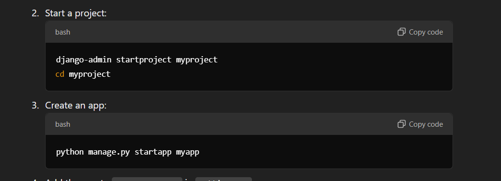

1. __init__.py file is used to mark a directory as a Python package.
2. asgi.py
   Configures Django for ASGI (Asynchronous Server Gateway Interface), allowing for asynchronous communication and real-time features.
3. wsgi.py
   Configures Django for WSGI (Web Server Gateway Interface), used for deploying the application to production servers.
4. static/
   This directory is used to store static files like CSS, JavaScript, and images that are served to the client. and some other info too
5.  urls.py
    This file is used to define URL patterns for your project or app. It maps URLs to their corresponding views.
6. manage.py
   A command-line utility for managing your Django project. It can be used to run the development server, create migrations, interact with the database, and more.
7. settings.py
   This file contains the configuration for your Django project, including database settings, middleware, installed apps, templates, and more.


// now Im goinf to start my blog app with this django
cmd :- python .\manage.py startapp


1. views.py
Contains the logic for handling requests and returning responses. Views act as the middle layer between the templates and the models.
2. models.py
   Defines the structure of your database tables using Django's Object-Relational Mapping (ORM). Each model corresponds to a table in the database.
3. apps.py
   Contains configuration for the app. Django uses this file to register the app and provide app-specific metadata.
4. admin.py
   Used to register models with the Django admin site and customize their display in the admin interface.
5. tests.py
   Contains test cases for your app to ensure functionality works as expected.


// python manage.py makemigrations after creating a  model
// ''    ''           migrate


# Okay let's recap on how to start with Django and end with all learned very simple data showing application...



Add the app name to INSTALLED_APPS in settings.py:

configure the DB
````angular2html
DATABASES = {
    'default': {
        'ENGINE': 'django.db.backends.mysql',  # Replace with your DB (e.g., 'django.db.backends.postgresql')
        'NAME': 'mydatabase',
        'USER': 'myuser',
        'PASSWORD': 'mypassword',
        'HOST': 'localhost',
        'PORT': '3306',
    }
}


````

pip install mysqlclient
iff needed

define models

````angular2html
from django.db import models

class Product(models.Model):
    name = models.CharField(max_length=100)
    price = models.DecimalField(max_digits=10, decimal_places=2)
    description = models.TextField()

    def __str__(self):
        return self.name

````

```angular2html
python manage.py makemigrations
python manage.py migrate

```


myapp/views.py
```angular2html
from django.shortcuts import render
from .models import Product

def product_list(request):
    products = Product.objects.all()  # Fetch all products
    return render(request, 'product_list.html', {'products': products})

```

Display.html

````angular2html
<!DOCTYPE html>
<html lang="en">
<head>
    <meta charset="UTF-8">
    <meta name="viewport" content="width=device-width, initial-scale=1.0">
    <title>Product List</title>
</head>
<body>
    <h1>Product List</h1>
    <ul>
        
            <li>{{ product.name }} - ${{ product.price }}</li>
        
    </ul>
</body>
</html>

````


python manage.py runserver


# Others


## In Summary
Outer folder: Project-level container; includes manage.py and your app(s).
Inner folder: Core Django configurations; contains settings.py, urls.py, etc.


